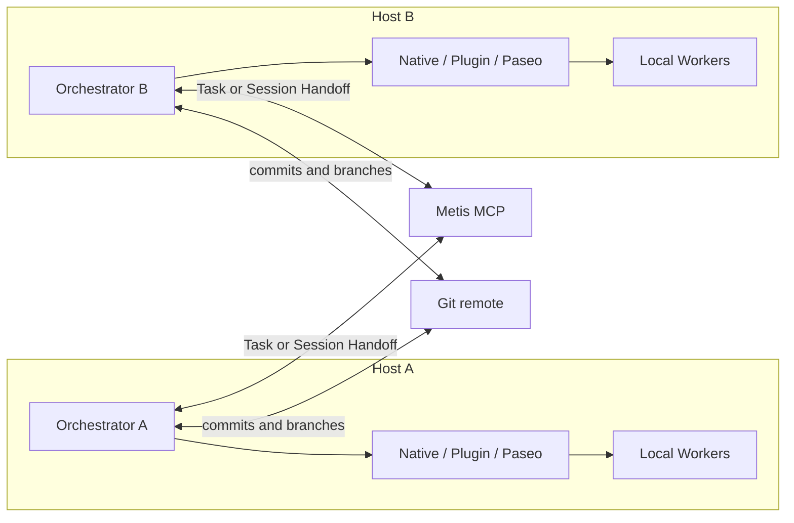
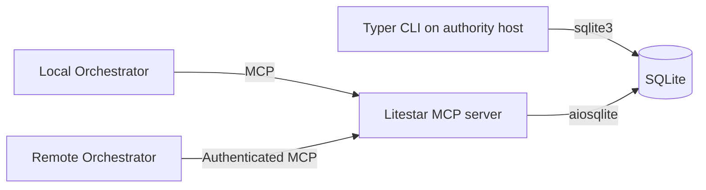

# Metis Coordination Utility

Status: Consolidated draft for external review

Last updated: 2026-07-22

## Objective

Metis is a small, durable coordination layer around existing coding-agent
harnesses. It preserves compact Task state and supports explicit handoff, but
never runs agents itself.

It must:

1. Preserve a Task's objective, completion criteria, decisions, progress,
   evidence, blockers, and next action.
2. Support Task Handoff and Session Handoff across sessions, providers, and
   hosts without retaining complete transcripts.
3. Give Claude Code, Codex, OpenCode, and similar harnesses the same compact
   context through a CLI or MCP server.
4. Integrate with `codex-plugin-cc`, Paseo, and native harness features instead
   of recreating their orchestration capabilities.
5. Allow only Orchestrator-to-Orchestrator communication across hosts.
6. Enforce that one leader owns no more than three open Tasks.

Success means that a new Orchestrator can recover an open Task, verify its code
and artifact references, take leadership when needed, and continue without the
previous chat transcript.

## Boundaries

Metis is not an agent harness, provider abstraction, scheduler, message bus,
model gateway, or project-management system. It does not:

- spawn, steer, monitor, or terminate agents;
- manage Workers, worktrees, permissions, sandboxes, or background processes;
- choose models or proxy inference requests;
- provide a cross-host Worker mesh or shared work queue;
- retain full transcripts, hidden reasoning, raw logs, patches, or large
  artifacts;
- synchronize SQLite files between hosts;
- replace Claude Code, Codex, OpenCode, Paseo, Git, or native harness features.

Git carries code between hosts. External storage carries large artifacts.
Metis stores only compact state and references to those artifacts.

## Roles

- **Task:** the durable unit of work. A blocked Task remains open.
- **Orchestrator:** owns Task-level judgment, delegation, compaction, and result
  acceptance. Each open Task has one leader; one leader may own at most three.
- **Worker:** performs bounded work under a local Orchestrator and reports back
  through the native harness, `codex-plugin-cc`, or Paseo.

Workers do not need direct Metis access. The local Orchestrator decides which
results are durable enough to record.

Routing is based first on the **harness**, then on the provider or model.
`codex-plugin-cc` is available when the Orchestrator is running in Claude Code;
selecting a Claude model in another harness does not make the plugin available.

## Two handoff types

| Type | What moves | Required portable context | Authority effect |
|---|---|---|---|
| **Task Handoff** | A bounded work package or the whole Task | Objective, `done_when`, decisions, constraints, write scope, Git base, output contract | `delegate` keeps the leader; `transfer` calls `take_task` |
| **Session Handoff** | Continuity of work already in progress | Compact state, entry watermark, attempts, blockers, next action, Git/artifact references | If leadership moves, the receiver calls `take_task` |

A Session Handoff may include an opaque native session or thread reference. It
is only an optimization: native sessions depend on their harness, host-local
state, authentication, and checkout. The compact Metis context remains the
portable fallback.

## Communication topologies

### Local orchestration

One Orchestrator communicates with its local Workers through the narrowest
available integration:

| Orchestrator harness | Worker | Preferred route |
|---|---|---|
| Claude Code, with an Opus/Fable or other Claude configuration | Codex | `codex-plugin-cc` |
| Claude Code | OpenCode or another provider | Paseo |
| Codex | A different provider | Paseo |
| OpenCode | A different provider | Paseo |
| Any harness | Same-provider native Worker | Native harness facility |

All local cross-provider collaboration uses Paseo except for the preferred
Claude Code-to-Codex path through `codex-plugin-cc`. Paseo is also the fallback
when that plugin is unavailable or cannot express the workflow.

Useful mappings:

- `/codex:rescue` -> bounded Task delegation to Codex;
- `/codex:review` and `/codex:adversarial-review` -> read-only review;
- `/codex:transfer` -> same-host Claude Code-to-Codex Session Handoff;
- `paseo-handoff` -> self-contained cross-provider Task Handoff;
- `paseo-advisor` -> second opinion without responsibility transfer;
- `paseo-committee` -> contrasting planning or diagnosis;
- `paseo-loop` -> bounded worker/verifier iteration.

Metis records the accepted outcome, not the integration's status stream or
logs.

### Remote orchestration

Each host is an independent orchestration island. Across hosts:

- only Orchestrators communicate through Metis;
- Workers report only to their local Orchestrator;
- a remote handoff targets the remote Orchestrator, which chooses its own local
  Workers and integrations;
- code moves through Git commits or branches;
- other artifacts move through external storage and are referenced by location
  plus an optional digest.

Paseo supports remote-daemon workflows, but Metis does not depend on them for
cross-host Worker control. This is an intentional boundary, not a Paseo
limitation.

## Architecture

One authoritative Metis service owns one SQLite database. Remote access is
shared access to that authority, not database synchronization.

The initial CLI operates on the authority host. Remote Orchestrators use MCP;
a remote CLI mode is not required. Remote MCP should remain behind an SSH
tunnel, private network, or authenticated TLS reverse proxy.

There is no internal agent runner, provider adapter, scheduler, broker, Worker
registry, or background service beyond the MCP process itself.

## Data model

Version one uses two tables.

### `task`

| Column | Purpose |
|---|---|
| `id` | Stable Task identifier |
| `workspace_id` | Stable project key, independent of checkout path |
| `title` | Human-readable name |
| `objective` | Required desired outcome |
| `done_when` | Required verifiable completion criteria |
| `status` | `open`, `done`, or `cancelled` |
| `leader` | Opaque current Orchestrator identifier |
| `leader_version` | Incremented on leadership transfer |
| `summary` | Latest compact Task context |
| `summary_through_entry_id` | Last entry covered by the summary |
| `created_at`, `updated_at` | UTC timestamps |

`workspace_id` is a user-selected stable key or normalized repository identity.
Absolute checkout paths are host-local and never authoritative shared state.

### `entry`

| Column | Purpose |
|---|---|
| `id` | Monotonically increasing identifier |
| `task_id` | Parent Task |
| `kind` | Update category |
| `content` | Compact Markdown or plain text |
| `actor` | Contributing Orchestrator or user |
| `data` | Optional small JSON object |
| `created_at` | UTC timestamp |

Initial kinds are `decision`, `progress`, `result`, `verification`, `blocker`,
`task_handoff`, `session_handoff`, and `reference`.

Handoff details remain in `entry.data`. Native session IDs, Paseo agent IDs,
Codex thread IDs, Git refs, job directories, and artifact URLs are opaque
references. No session, handoff, Worker, artifact, run, or server table is
needed initially.

Actor identifiers should include recognizable provenance, for example
`host-a/claude-code/session-123`, but Metis does not maintain an actor registry.

## Leadership and context

`take_task` is one transaction that verifies the three-Task limit and expected
`leader_version`, changes the leader, increments the version, and appends the
handoff entry. Creating an open Task performs the same limit check; completing
or cancelling it releases the slot.

There are no leases, heartbeats, timeouts, or automatic takeovers. Explicit
transfer plus optimistic version checking rejects stale leader writes.

Only the leader may change the objective, `done_when`, status, or summary. A
participating Orchestrator may append an attributed result, verification,
blocker, or reference; the leader decides whether to accept it.

`get_task_context` returns the Task, its summary, and all entries after
`summary_through_entry_id`. Compaction is explicit and leader-controlled;
covered entries are retained. Metis never invokes a model to summarize them.

Context is exchanged at delegation, blocker, completion, compaction, or
leadership-transfer boundaries rather than continuously synchronizing chats.

## Domain operations

| Operation | Purpose |
|---|---|
| `create_task` | Create an open Task after enforcing the leader limit |
| `list_tasks` | Filter Tasks by workspace, status, or leader |
| `get_task_context` | Return Task, summary, and uncompacted entries |
| `take_task` | Transfer leadership with version checking |
| `update_task` | Change leader-owned fields |
| `append_entry` | Add an update, handoff, result, or reference |
| `compact_task` | Replace the summary and advance its watermark |

The MCP surface exposes no tools for agent creation, provider selection,
worktrees, Worker prompts, or job polling. Those remain direct operations of
the native harness, `codex-plugin-cc`, or Paseo.

## Technology and storage

- Python 3.14
- Typer and standard-library `sqlite3` for the CLI
- Litestar, msgspec, and aiosqlite for the MCP server
- official MCP Python SDK behind a small adapter

The default database is `~/.metis/metis.db`, overridable with `METIS_DB`.

Connections use the modern `autocommit` API with `autocommit=False`.
Synchronous code combines a connection transaction context manager with
`contextlib.closing`; asynchronous code provides matching connection and
transaction contexts. Each connection enables foreign keys and a bounded busy
timeout. Initialization enables WAL. Schema changes use `PRAGMA user_version`;
no ORM or migration framework is required.

## Core workflows

1. **Claude Code -> local Codex:** use `codex-plugin-cc`; record only accepted
   results and evidence in Metis.
2. **Other local cross-provider work:** use the appropriate Paseo skill; Paseo
   owns agent and worktree lifecycle.
3. **Remote Task Handoff:** Orchestrator A records a compact request and Git
   base; Orchestrator B performs local orchestration and returns compact results
   plus Git or artifact references.
4. **Session Handoff:** record compact current state; use a native transfer such
   as `/codex:transfer` where available, otherwise resume from Metis context. If
   leadership moves, call `take_task` before authoritative updates.

No Worker communicates across a host boundary in these workflows.

## Delivery phases

1. Dogfood both handoff contracts using `codex-plugin-cc`, Paseo, and manually
   inspectable handoff content.
2. Implement the two-table SQLite store, Typer CLI, and local MCP facade.
3. Add authenticated remote MCP access for Orchestrators only.

Do not add the next concept until a real workflow demonstrates that the current
model is insufficient.

## Acceptance criteria

1. A leader cannot create or take a fourth open Task.
2. Leadership transfer rejects stale versions.
3. Both handoff types fit the two-table model.
4. Context retrieval and lossless compaction work through CLI and MCP.
5. Local agent execution remains owned by native harnesses,
   `codex-plugin-cc`, or Paseo.
6. Across hosts, only Orchestrators exchange Metis state.
7. Workspace and artifact references remain meaningful across checkout paths.
8. One authoritative SQLite database provides global ownership without file
   synchronization.
9. Metis never starts an agent or stores a complete transcript.

## Deferred MCP questions

1. Should remote MCP ship initially or only after local dogfooding?
2. Should authentication terminate in Litestar or a private reverse proxy?
3. How should `workspace_id` normalize SSH, HTTPS, fork, and non-Git projects?
4. Does the selected MCP SDK version mount cleanly under Litestar without
   leaking transport types into the domain layer?
5. Do real workflows ever require a handoff table, or are typed entries enough?

## References

- [OpenAI Codex plugin for Claude Code](https://github.com/openai/codex-plugin-cc)
- [Paseo](https://github.com/getpaseo/paseo)
- [Paseo skills](https://github.com/getpaseo/paseo/tree/main/skills)
- [Paseo handoff](https://github.com/getpaseo/paseo/tree/main/skills/paseo-handoff)
- [Paseo advisor](https://github.com/getpaseo/paseo/tree/main/skills/paseo-advisor)
- [Paseo committee](https://github.com/getpaseo/paseo/tree/main/skills/paseo-committee)
- [Paseo loop](https://github.com/getpaseo/paseo/tree/main/skills/paseo-loop)
- [Codex App Server](https://learn.chatgpt.com/docs/app-server)
- [Codex MCP](https://learn.chatgpt.com/docs/extend/mcp?surface=cli)
- [Python 3.14 `sqlite3` transaction control](https://docs.python.org/3.14/library/sqlite3.html#transaction-control-via-the-autocommit-attribute)
- [Official MCP Python SDK](https://github.com/modelcontextprotocol/python-sdk)
